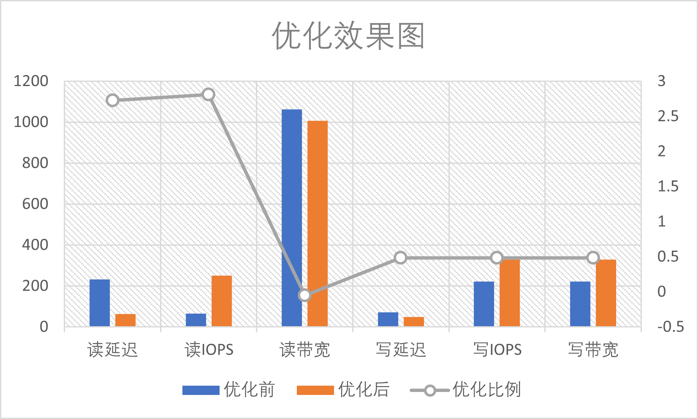
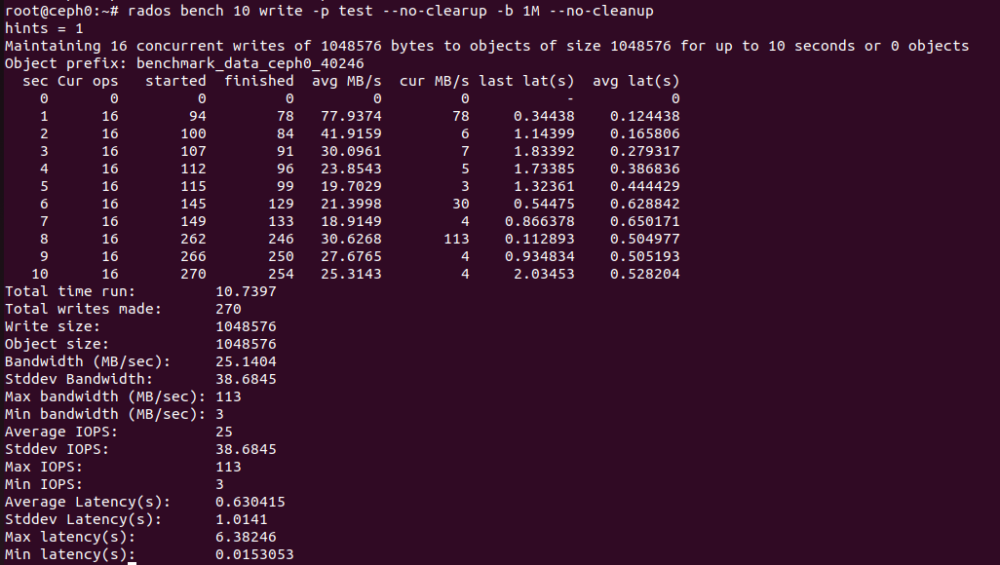
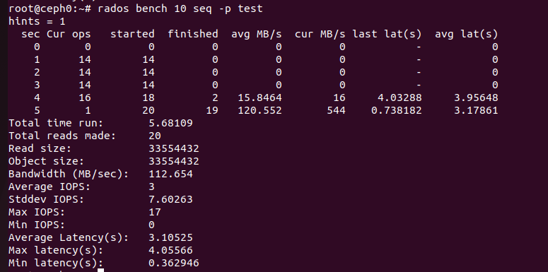
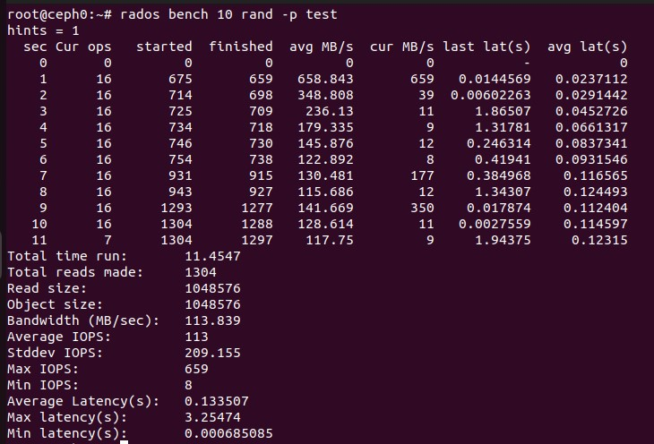

# Ceph的测试

实验4 实验报告（Part2）

### 单机测试与优化

##### 测试环境

此时只需要使用一个虚拟机，可以提供更充裕的性能。相比多机，单机测试的环境如下：

- 仍为Ubuntu 22.04.3 LTS；
- 6GB内存；
- 4个单核处理器，物理机CPU为Core i5-11400H；
- 四个SCSI硬盘，主硬盘32G用于安装Ubuntu系统本身和必要软件，三个16G新硬盘完全交给Ceph用于存储；
- 指定的集群网络仍为Host-Only网络，其中虚拟机只有自身，ip为`192.168.244.129`。
- cephadm和ceph版本均为目前最新版本17。

##### 评测指标的选取

- 读/写延迟，指发起 IO 请求到存储系统把 IO 处理完成的时间间隔。

  **合理性**：IO延迟直接决定存储服务响应的速度，反映出存储系统反应的快慢。

- 读/写IOPS，即每秒钟能处理的读写请求数量。

  **合理性**：IOPS直接反映存储系统处理高并发的能力，决定了存储系统服务的规模。

- 读/写吞吐率（带宽），即总大小/总时间。

  **合理性**：吞吐率反映处存储系统处理大规模数据的速度，即能够应对多少数据。

- 故障率，即服务不可用时间/总时间。

  **合理性**：故障率与服务的稳定性直接相连，服务不稳定会带来巨大的损失。

- 服务规模，即Ceph最大支持的主机数、硬盘数和存储容量。

  **合理性**：Ceph作为分布式存储的框架，需要支持超大规模的存储才能发挥其作用。

小组选择前3项指标，在顺序读、随机读、写三种情况下进行测试，以测试程序显示的Average Latency、Average IOPS、Bandwidth为准。

##### 初步测试

首先使用--no-cleanup选项写入数据（硬盘占用70%左右），模拟运行中状态。我们创建一个pool `test`，使用自带的`rados bench`工具，分别进行五次写测试、五次顺序读测试、五次随机读测试。测试的截图可以在`src/优化前`找到，下面是优化前的数据。顺序读和随机读虽然性质不同，但在实测时发现各项指标差别不大，因此合并为一项：

| 类型 | 延迟(ms) | IOPS  | 带宽(MB/s) |
| :--: | :------: | :---: | :--------: |
|  读  | 232.858  | 65.9  |  1062.653  |
|  写  |  72.279  | 221.8 |  222.4726  |

##### 优化的策略

为了提升效率，改变参数如下：

- 增大默认pg_num到128
- 禁用部分in-memory logging：`ceph tell osd.* config set debug_osd 0/0`
- 增大OSD最大写入大小：osd_max_write_size=256
- 降低Recovery优先级（可以在dashboard完成）
- 减少scrubbing操作（可以在dashboard完成）
- 操作系统配置：
  - 硬盘预读取（加速顺序读）：`echo 4096 > /sys/block/sdb/queue/read_ahead_kb`
  - 加深磁盘请求队列：`echo 1024 > /sys/block/sdb/queue/nr_requests`

随后再进行五次写测试、五次顺序读测试、五次随机读测试。测试的截图可以在`src/优化后`找到，下面是优化后的数据：

| 类型 | 延迟(ms) | IOPS  | 带宽(MB/s) |
| :--: | :------: | :---: | :--------: |
|  读  |  62.525  | 251.1 |  1006.271  |
|  写  |  48.704  |  329  |  329.5892  |

如图所示，优化后读带宽略微下降5%，读延迟、读IOPS两项指标分别优化272%、281%，写延迟、写IOPS、写带宽三项指标优化率为48%左右，总体来说优化率>20%。

### 多机测试

##### 测试环境

多机测试环境即为部署文档中的环境。

##### 多机测试

对这个分布式集群做简单的性能测试。我们使用自带的`rados bench`工具，对写、随机读、顺序读三项功能的各项指标做基本测试。

- 首先，需要创建一个pool，之后的测试在这个pool上进行：`ceph osd pool create test {pg_num}`。其中，`pg_num`是池中`placement groups`的大小设置，这里我们不指定，Ceph就会自动为我们动态管理。

  - 之后就可以运行`rados bench`测试： `rados bench -p {pool} {time} read|rand|seq --no-cleanup`

  - 三种测试的部分数据如下，其中seq测试的性能波动较大。

    
    
    