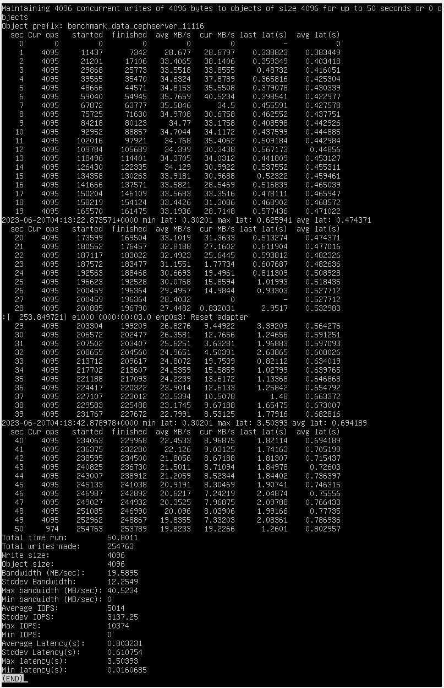
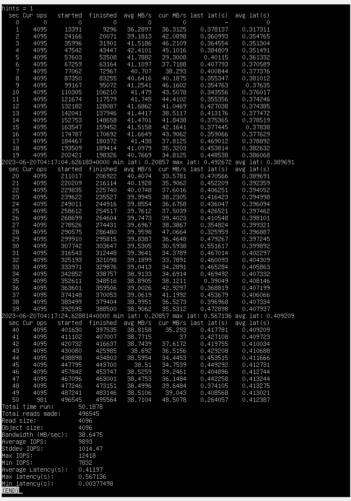
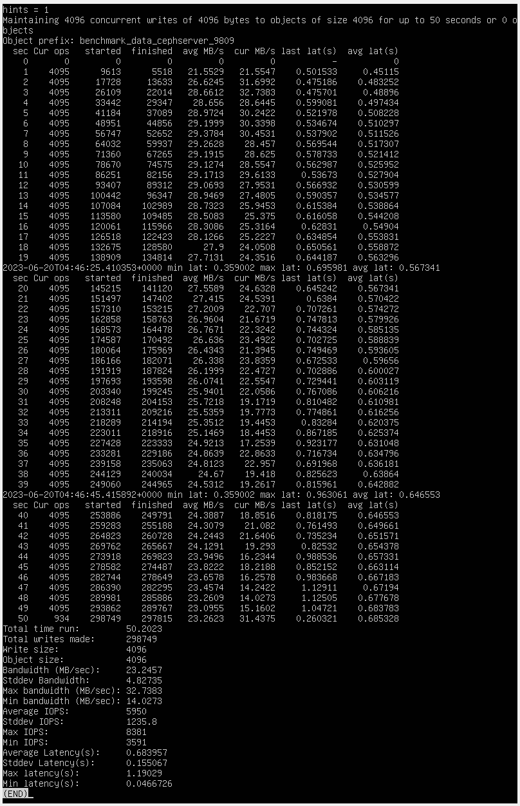
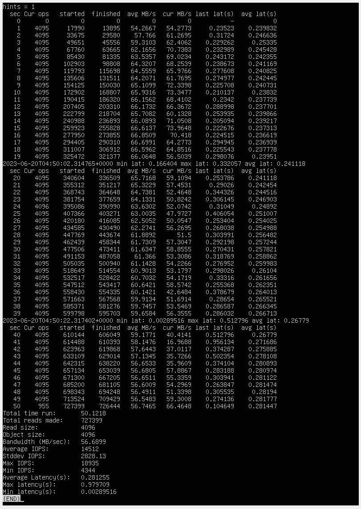

# Ceph单机部署、调优

## 单机部署

### 测试环境

VitrualBox 7.0.8 r156879(Qt5.15.2)虚拟机

- 8GB内存
- 4个处理器核，物理机CPU为intel Core i7-1165G7
- 四个VID格式硬盘，一个10GB盘安装Ubuntu server20.04.6LTS,另外3个8GB盘作为ceph的OSD盘
- cephadm与ceph版本均为17.2.6
- 网络使用默认NAT设置

### 准备处理

- 首先安装操作系统，按照[官方链接](https://ubuntu.com/server/docs/install/step-by-step)下载并安装Ubuntu Server操作系统。因为Ceph在官网中称其[针对这一系统版本进行了详细的测试](https://docs.ceph.com/en/quincy/start/os-recommendations/)，在此选择20.04.6版本。为加速下载，可以在安装系统时在设置https://mirrors.ustc.edu.cn/作为国内镜像。

- 第一次启动系统后依次运行`apt update && apt upgrade`更新操作系统软件包；**运行`apt install ssh`安装ssh**。

- 依照官网教程的[curl-based installation一节](https://docs.ceph.com/en/reef/cephadm/install/#cephadm-install-curl)下载cephadm（可将`download.ceph.com`换成`mirrors.ustc.edu.cn/ceph`以使用镜像）。使用`./cephadm install`完成cephadm的安装，同时自动将cephadm加入环境变量、配置docker等。运行后原来的cepadm文件夹可以删除。
  - 由于Linux版本问题，使用apt安装cephadm可能造成版本滞后，导致文档中指令无法使用，因此不建议使用`apt install cephadm`。

- 如果上一节没有运行`./cephadm install`则需要自行安装docker。

- 为了防止下载速度过慢，可以先使用`docker pull quay.mirrors.ustc.edu.cn/ceph/ceph:v17.2.6`将ceph pull下来，其中`quay.mirrors.ustc.edu.cn`为镜像站地址，`v17.2.6`为安装版本。

### 单机部署

- 按照[安装文档](https://docs.ceph.com/en/quincy/cephadm/install/#bootstrap-a-new-cluster)运行`cephadm bootstrap --mon-ip *<mon-ip>* --single-host-defaults`安装集群(<mon-ip>为本机IP,可以用`ip addr`查看)，**注意分居教程及控制台输出这里已经使用了docker部署**。

- 安装完成后**记录下控制台中输出的账号及密码**防止丢失。

- 运行`cephadm install ceph-common`安装`ceph`命令。

- 按照[加入OSD文档](https://docs.ceph.com/en/quincy/cephadm/services/osd/#creating-new-osds)依次加入OSD。为了防止长时间无法找到设备，可以用`ceph orch daemon add osd *<host>*:*<device-path>*`选择特定设备，而不是使用`ceph orch apply osd --all-available-devices`指定所有空闲设备。

- 根据[dashboard文档](https://docs.ceph.com/en/quincy/mgr/dashboard/#password-policy)，可以输入`ceph dashboard set-pwd-policy-enabled false`关闭密码检查，避免强制要求更改复杂密码。

- 在vbox中设定端口转发规则：127.0.0.1:8443->10.0.2.15:8443，便可以在**宿主机浏览器**输入`https://127.0.0.1:8443`直接访问虚拟dashboard，登陆账户及密码在bootstrap中给出。dashboard功能比较强大，可以加入pool、调整集群参数等，如[文档](https://docs.ceph.com/en/quincy/mgr/dashboard/)所示。

- 根据[文档](https://docs.ceph.com/en/quincy/mgr/dashboard/#user-accounts)，如果之前忘记记录账户、密码，可以使用命令`ceph dashboard ac-user-show`查看用户，并使用命令`ceph dashboard ac-user-set-password <username> -i <file-containing-password>`更改用户密码。

## 单机调优

测试环境与前面相同，参数选取与主文档相同，考虑测试背景为对小文件的高并发请求下的优化。

### 测试步骤

首先在dashboard或shell中创建用于测试的pool。使用`rados bench -p <poolname> 50 write -t 4096 -b 4KB --no-cleanup | less `创建4096个线程写入50秒数据，用`rados bench -p <poolname> 50 rand -t 4096 | less `创建4096个线程（随机）读取50秒数据。

### 调优参数

本次调优参数都可以在dashboard中调整。调整参数为：

- 由于磁盘io能力较强，可以增加`osd_mclock_iops_capacity_threshold_hdd`参数的值,这里从500增大到5000；

- 将`rgw_max_concurrent_requests`从1024增大到4096；

- 将`rgw_thread_pool_size`，从512增大到2048；这两项可以增大线程数，以适应高并发环境；

- PG数目从`自动`调整到`手动32个`，防止单个PG文件过多。

### 测试结果

在调优和未调优的环境下分别运行测试，可以看到有明显超过20%的性能提升。具体如下：

#### 未调优

写：

读：

#### 调优后

写：

读：
