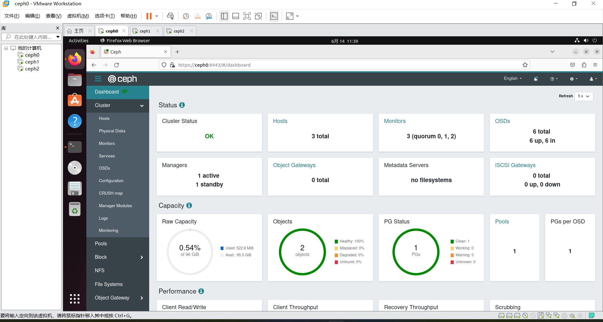
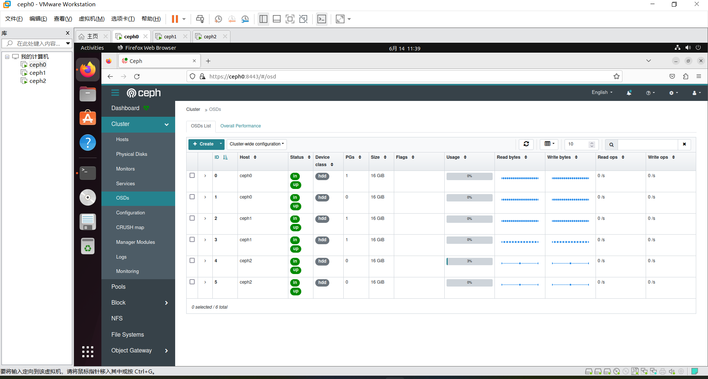

# Ceph的部署

实验4 实验报告（Part1）

### 运行环境

#### 环境选择1：VMWare Workstation Pro17虚拟机

VMWare Workstation Pro17虚拟机。使用三台虚拟机`ceph0` `ceph1` `ceph2`组成Ceph集群，三台虚拟机均为Ubuntu 22.04.3 LTS，硬件配置相同如下：

- 4GB内存；
- 2个单核处理器，物理机CPU为Core i5-11400H；
- 三SCSI硬盘，其中主硬盘32G用于安装Ubuntu系统本身和必要软件；两个16G新硬盘完全交给Ceph；
- 虚拟机之间通过Host-Only网络连接，使用DHCP，将重新分配间隔调至最长，这样可以认为在实验时间内为静态IP（当然，通过修改DHCP配置文件也可以直接分配静态IP段）。该网络中三台机器的IP分别为`192.168.244.129` - `192.168.244.131`；
- cephadm和ceph版本均为目前最新版本17。

#### 环境选择2：VitrualBox 7.0.8 r156879(Qt5.15.2)虚拟机

VitrualBox 7.0.8 r156879(Qt5.15.2)虚拟机。仅测试单机部署及性能调优。

- 8GB内存
- 4个处理器核，物理机CPU为intel Core i7-1165G7
- 四个VID格式硬盘，一个10GB盘安装Ubuntu server20.04.6LTS,另外3个8GB盘作为ceph的OSD盘
- cephadm与ceph版本均为17.2.6
- 网络使用默认NAT设置，但设定端口转发规则：127.0.0.1:8443->10.0.2.15:8443

### 预处理

注意：不加说明，以下操作均在ceph0节点的root用户下进行（使用`sudo -i`进入）

#### 选择1

- 首先`sudo vim /etc/hosts`将三台机器的IP互相加入到HOSTS文件中。
- 需要安装的必要软件有`openssh-server docker net-tools`等。
- 先使用`ssh-copy-id`将ceph0的公钥拷贝到ceph1, ceph2的`authorized_keys`文件中。注意由于安全原因，该命令并不能直接拷贝到root用户，但我们可以用非root用户作为中转站。
- Ceph镜像从quay.io下载较慢，可以先从USTC镜像将其pull下来，这样cephadm会直接使用该镜像。（另两台虚拟机也可以先pull下来）

#### 选择2

- 首先安装操作系统，按照[官方链接](https://ubuntu.com/server/docs/install/step-by-step) 下载并安装好ubuntu server操作系统，选择20.04.6是因为ceph官网上说明针对这一系统版本进行了详细的测试[链接](https://docs.ceph.com/en/quincy/start/os-recommendations/)。注意安装系统时在设置镜像(Mirror)阶段设置国内镜像，对于USTC学生果断设置https://mirrors.ustc.edu.cn/

- 第一次启动系统后依次运行`apt update`,`apt upgrade`更新操作系统软件包，然后**运行`apt install ssh`安装ssh**

- 依照[官网教程的curl-based installation一节](https://docs.ceph.com/en/reef/cephadm/install/#cephadm-install-curl)下载cephadm,注意如果要使用镜像可将`download.ceph.com`换成`mirrors.ustc.edu.cn/ceph`。千万不要用apt,否则版本可能滞后，导致文档中指令无法使用。推荐运行一下`./cephadm install`以自动将cephadm加入环境变量同时自动配置docker等。运行后原来的cepadm软件可以删除。

- 如果上一节没有运行`./cephadm install`则需要自行安装docker,请自行搜索方法。

- 为了加快安装速度，一定要运行`docker pull quay.mirrors.ustc.edu.cn/ceph/ceph:v17.2.6`，注意`quay.mirrors.ustc.edu.cn`为镜像站地址，`v17.2.6`为安装版本。

### 单机部署

过去使用较多的`ceph-deploy`工具事实上已经被弃用了，这里我们使用Ceph官方推荐的cephadm工具完成部署。

#### 选择1

- cephadm可以通过包括apt在内的很多方式安装。这里直接使用apt即可。
- 理论上使用`cephadm bootstrap --mon-ip 192.168.244.129`（mon-ip即为自身ip）一个命令即可完成单机部署。实际上运行过程中可能出现一些问题，不过相对来说都比较好解决；完成bootstrap之后，cephadm会提供`ceph dashboard`的网址（一般为`localhost:8443`）、初始账号密码，以登录dashboard，以通过图形化的方式监控、调整集群。
  - 注意：单机不应该是一个集群的正常状态，因此在该状态下ceph会对状态进行警告，并且可能某些功能无法正常使用。如果该集群确实之后一直要在单机状态下工作（如单机测试、调优时），需要在部署时添加`--single-host-defaults`参数。
  - 图形化界面的功能相当有限，用来作为获取集群当前状态信息的工具即可，不应作为管理集群的主要方式。

- 之后运行`cephadm install ceph-common`，即可正常使用`ceph`命令，对集群进行管理。

#### 选择2

- 按照[安装文档](https://docs.ceph.com/en/quincy/cephadm/install/#bootstrap-a-new-cluster)运行`cephadm bootstrap --mon-ip *<mon-ip>* --single-host-defaults`安装集群(<mon-ip>改成自己机器ip,可以用`ip addr`查看)，**注意按照教程及控制台输出这里已经自动化使用docker部署**

- 安装完成后请**记录下控制台中输出的账号及密码**

- 运行一下`cephadm install ceph-common`安装`ceph`命令

- 按照[加入OSD文档](https://docs.ceph.com/en/quincy/cephadm/services/osd/#creating-new-osds)依次加入OSD，**注意一定要用`ceph orch daemon add osd *<host>*:*<device-path>*`加入OSD,不要用`ceph orch apply osd --all-available-devices`,否则可能出现10分钟找不到OSD的情况**

- 按照[dashboard文档](https://docs.ceph.com/en/quincy/mgr/dashboard/#password-policy)输入`ceph dashboard set-pwd-policy-enabled false`关闭密码检查，否则下一步登陆dashboard时要改的密码会比较复杂。

- 在**宿主机浏览器**输入`https://127.0.0.1:8443`访问dashboard，登陆账户及密码为之前记下的账户及密码。dashboard功能比较强大，可以加入pool、调整集群参数等，[具体请看文档](https://docs.ceph.com/en/quincy/mgr/dashboard/)

- 如果之前忘记记录账户、密码，可以使用命令`ceph dashboard ac-user-show`查看用户，使用命令`ceph dashboard ac-user-set-password <username> -i <file-containing-password>`更改用户密码，[具体请看文档](https://docs.ceph.com/en/quincy/mgr/dashboard/#user-accounts)

### 多机部署

#### 选择1

单机不应该是一个集群的正常状态。事实上，在上面的步骤完成之后，`ceph status`会对集群的健康进行警告，报告包括OSD数量<3等问题。为了解决这个问题，我们首先应当为集群添加新的机器。

- 添加新的机器前，需要让Ceph能够控制远程机器，因此再用一遍`ssh-copy-id`：
  `ssh-copy-id -f -i /etc/ceph/ceph.pub root@ceph1`(ceph2)
  - 在上一次`ssh-copy-id`成功进行的前提下，这次运行命令应该能直接顺利完成。
- 之后运行`ceph orch host add ceph1 *<ip>* --labels _admin`，即可将另两台机器作为admin加入到集群。
- 接下来需要给集群加入存储服务。使用`ceph orch apply osd --all-available-devices`，告知Ceph计划在所有空闲磁盘上部署OSD。之后，部署在六个硬盘上的OSD会逐个加入到集群中。完成这一步之后，其实已经完成部署了一个健康的集群。
  
  

本内容发布在[知乎专栏](https://zhuanlan.zhihu.com/p/638303111)

