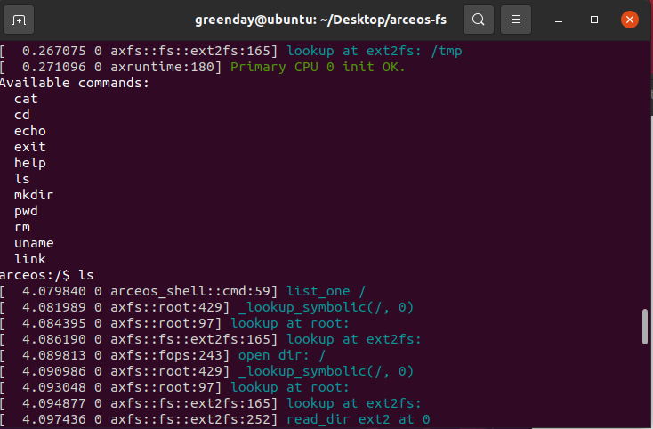

# Ext2 文件系统的实现和测试

### Ext2文件系统概述

​	Ext2文件系统最早由Rémy Card于1993年设计并实现。它是对原始Ext文件系统的改进，支持更大的文件系统容量、更高的性能和更好的可靠性。Ext2文件系统被广泛用于Linux系统上的硬盘驱动器分区，适用于各种应用场景。

​	 Ext2文件系统采用基于磁盘的数据结构来组织文件和目录。它使用超级块、组描述符、索引节点（inode）和数据块来存储文件系统的元数据和用户数据。Ext2采用分组的方式组织数据块，每个分组包含一组数据块、索引节点和目录。这种组织方式提供了更高的文件系统效率和灵活性。现如今主流Linux发行版采用Ext4文件系统，但Ext2文件系统易于实现，资源利用率高，非常适合应用在ArceOS之上。

### Ext2文件系统的实现

​	在ArceOS中，主要使用/ulib/libax中fs库中的函数（类似于rust中的std）访问文件系统，这些函数被模块/module/axfs实现。该模块提供了一套vfs（虚拟文件系统）接口。新的文件系统只需正确实现这些接口，并在文件系统的初始化过程中，用#cfg选择对应的文件系统就可以挂在新的文件系统。因此在该模块中使用一些包装类就可以无缝对接ArceOS代码实现。

```rust
impl VfsOps for Ext2FileSystem
impl VfsNodeOps for Ext2SymlinkWrapper
impl VfsNodeOps for Ext2FileWrapper
impl VfsNodeOps for Ext2DirWrapper
```

​	真正实现Ext2文件系统具体内容是在/crates/ext2fs当中。这个箱子借鉴了easy-fs的文件系统库，借助BlockDevice的接口实现了Layout、Bitmap、Inode、Cache等核心内容，并向外提供对应接口。/module/axfs使用这些接口，

### Ext2文件系统的测试

测试的方法主要包括以下两种：

利用app/fs/shell进行测试。输入如下命令

```shell
make disk_img
make A=apps/fs/shell ARCH=riscv64 LOG=debug FS=y run
```

正常运行应该得到一个支持简单命令的shell。



通过运行这些命令，检查文件系统的正确性。