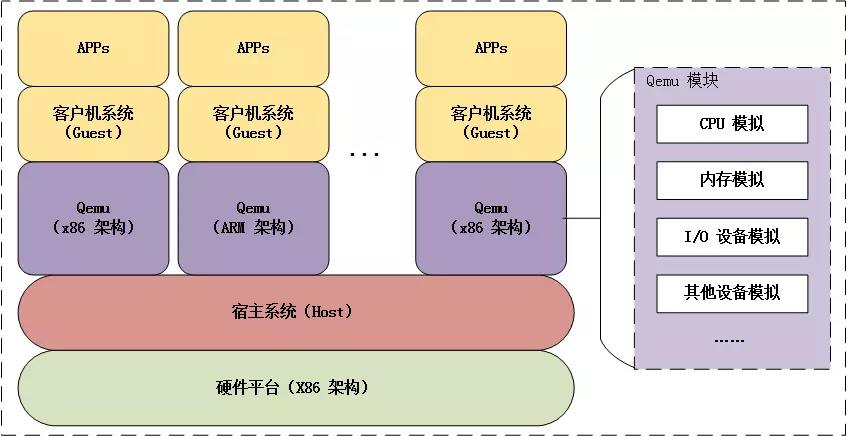

# 可行性报告

> **灵活组合的操作系统模块和框架—[ArceOS](https://github.com/rcore-os/arceos)**

### 理论依据

##### 1、组件化操作系统

​	随着各行各业与计算机技术的深度融合，OS新应用的需求不断出现。部分行业对操作系统的功能提出了特殊的要求，例如偏基础类的机器学习、机密计算，以及偏行业类的自动驾驶、工业机器人，但是现有的Linux、Windows、RTOS等传统通用操作系统不能充分地满足这些需求。因此，这些领域的开发者希望研发面向特定领域的新型操作系统。

​	开发组件化的定制操作系统是解决这个问题的方案之一。组件化操作系统能够快速适配未来多种多样的处理器、加速器、外设和应用需求，在开发的便捷性、性能和安全性等方面优于已有的通用操作系统。“组件化的定制操作系统”也是我们工作的根本理论依据。

##### 2、Unikernal的思想

​	Unikernel由库操作系统组成，是一个特殊的、单地址空间的机器镜像。开发者从中选择模块化栈和最小库集合，组成应用需要的最小化系统架构来运行。这些库跟应用和配置代码一起编译，来构建封闭的、固定用途的镜像（Unikernels），可以直接运行在hypervisor或硬件上，而不需要linux和windows这样的操作系统。Unikernel具有性能优、代码短、启动快、安全性高的优势，可以减小不必要的代码逻辑，让最简单的操作系统来运行应用。

​	在Unikernal理论的指引下诞生了许多优秀的工作，例如MirageOS、Unikraft等等。我们的大作业也将以Unikernal为主要的构建方式，服从Unikernal的原则。

##### 3、操作系统的功能

​	操作系统是一组相互关联的系统软件程序，负责和控制计算机操作，使用和运行硬件和软件资源，并提供公共服务来组织用户交互。操作系统的功能包括处理器管理、存储器管理、设备管理、文件管理、作业管理等等，其中：

- 存储器管理模块需要健壮的内存分配算法
- 设备管理需要实现不同的驱动程序
- 文件管理需要高效的文件系统
- 作业管理需要先进的进程调度机制

​	上述4个领域一直都是OS研究的热点问题。对ArceOS功能做出的优化，需要上述领域理论的支撑。

##### 4、指令集

​	当前计算机指令集的类型可以分为三类：精简指令集（RISC）、复杂指令集（CISC）和超长指令字（VLIW）。它们的作用是控制计算机执行特定的操作，包括算术运算、逻辑运算、存储和检索数据等。三类指令集各有其优缺点和应用范围，列表如下：

| 指令集 |                            优点                            |                  缺点                  |            应用            |    代表     |
| :----: | :--------------------------------------------------------: | :------------------------------------: | :------------------------: | :---------: |
|  RISC  | 指令长度短，编码规律性强，易于硬件实现和优化，高效率低功耗 |     指令数量多，指令执行的时间不同     |         通用计算机         | risc-v, arm |
|  CISC  |            支持复杂操作，指令数量少，存储空间少            |   指令编码复杂，实现难度大，容易出错   | 移动设备、智能家居、物联网 |     x86     |
|  VLIW  |                指令编码规律性强，执行效率高                | 硬件实现复杂，存储空间和运行时间开销大 |        嵌入式、GPU         |      \      |

​	不同的指令集架构难以兼容，而且在理论上存在不同的优缺点。这导致了多种指令集并存的情况。因此，我们需要让ArceOS适配更多的指令集架构，提升其通用性。

### 技术依据

##### 1、Ucore、Rcore和ArceOS项目

​	Ucore是清华大学计算机系副教授陈瑜所写的操作系统，主要基于 MIT 的 Frans Kaashoek 等人在 2006 年写的操作系统 xv6 的设计，该操作系统也被称为「麻雀」，因为这个操作系统包含虚存管理、进程管理、处理器调度、同步互斥、进程间通信、文件系统等主要内核功能，总的内核代码量（C+asm）不会超过 5K 行，充分体现了「麻雀虽小，五脏俱全」的精神。

​	Rcore是基于Ucore用Rust重新实现的兼容Linux的OS内核，诞生于 2018 年，目前已在清华计算机系的操作系统教学实验中试点应用。rCore 具有以下功能：网络堆栈、文件系统、信号系统、异步IO、内核模块

​	ArceOS是Rcore的一个子项目，是一个受到Unicraft启发，用 Rust 编写的实验性模块化操作系统（或单内核）。ArceOS提供了一套组件化的操作系统框架和各种内核组件的实现，支持形成不同形态的OS。ArceOS从下到上分为4层：Crate、Module、Ulib、App，体现了分层化、模块化的编程思想。其设计结构如下图所示。ArceOS正在迅速地开发，在 Github 仓库中能找到实时信息，为我们的开发提供了参考。

##### 2、Rust编程语言和项目管理工具

​	Rust适合操作系统开发的新兴编程语言，本项目的主角ArceOS就是基于Rust开发。Rust 语言具有与 C 一样的硬件控制能力，且大大强化了安全编程。Rust 的程序效率与 C 相近，但其现代性、抽象表达能力高于 C 语言，故 Rust 的程序开发效率高于 C，在内存管理、类型系统、编程范式、标准库等方面也优于C语言。

​	Rust 操作系统已经有一些知名的项目，如 Redox OS、rCore OS 和 Tock OS，也有一些著名的文档，例如rCore-Tutorial-Book。这些优点可以帮助我们更好的完成项目。

​	由于本项目规模较大，且涉及多种架构，因此需要规范的构建工具和交叉编译工具。ArceOS原项目含有大量Makefile文件，可以使用make编译项目；Rust自带的cargo帮助我们管理项目，而rustup可以方便的安装交叉编译的工具链，编译多种架构的操作系统。总之，make、cargo和rustup是这个项目的“小管家”，是本项目的重要技术点。

##### 3、Qemu虚拟机

​	由于特定架构的硬件实体难以获得，本项目针对不同架构的开发必须依赖虚拟机程序进行实验。Qemu是一款开源的虚拟机程序，能够测试操作系统在不同硬件环境下的表现。Qemu提供全系统仿真和用户模式仿真两种操作模式，能够在任意支持的架构上为任何机器运行一个完整的操作系统，是本项目的最佳选择。

### 创新点

##### 1、践行组件化OS的思想

​	通过更换若干个高内聚、低耦合的独立组件，彰显组件化OS的优势，有利于代码的复用和优化，还能更好地适应不同用户和场景的需求。

##### 2、完善ArceOS的功能

​	本工作引入先进的算法和技术，例如新的系统算法、IO模式、驱动程序，增加著名开源框架ArceOS的功能，可以实现更加快速、安全、可靠的操作ArceOS，为开源社区做出贡献。

##### 3、增强ArceOS跨平台能力

​	随着科技的不断发展，人们对操作系统的跨平台能力越来越高。开发更多架构、更多Qemu硬件的支持，可以提高ArceOS的可移植性和兼容性，满足ArceOS使用者的需求。

### 概要设计报告

##### 1、创新内核算法，更换系统组件

- 内存分配

  目前该项目利用Bitmap，实现了Buddy、Slab两种算法，涵盖了Linux的主流内存的分配方法。然而，当前项目中存在IdAllocator的接口而不存在IdAllocator的实现。因此，我们计划实现IdAllocator。【相关箱子：allocator、slab_allocator】同时，不同架构的页表结构不同，因此我们计划在更多架构上支持页表级的分配【相关箱子：page_table、page_table_entry；相关架构：aarch、rsicv、x86_64】

- 文件系统

  目前，项目实现了设备文件系统、虚拟文件系统提供文件操作的上层支持。【相关箱子：axfs_devfs、axfs_vfs、axfs】。目前，虚拟文件系统提供了/dev/null和/dev/zero的实现；我们计划实现更多的虚拟设备，如/dev/random；普通文件系统提供了FAT的实现，我们计划增加ext的实现。

- 进程调度

  目前，项目定义了了进程调度器的接口，实现了“先来先服务”和”轮询调度“两种内存调度算法。因此我们计划实现更多内存调度算法，包括优先级调度算法、多级反馈队列轮转算法等，并对这些算法进行性能测试。

##### 2、对多种架构提供支持

​		目前，ArceOS支持的架构包括三种：aarch、rsic-v、x86_64（对x86_64只提供部分支持）。我们计划实现mips架构的系统，并提升aarch、rsic-v、x86_64三种架构的兼容度。这就要求我们：

- 修改硬件适配【相关箱子：axhal，page*】
- 完善Qemu虚拟机的相关支持
- 提供交叉编译的文档教程以供参考

##### 3、（高阶·可选）实现中断驱动的设备IO

​	MMIO（Memory Mapped Input & Output）和中断都可以用于CPU与外设之间的通讯。目前ArceOS只支持MMIO结合轮询的方法访问外设，因此我们计划在有余力的情况下，实现中断驱动的设备IO，提升系统对外设的控制能力。

##### 4、（高阶·可选）开发ArceOS更多驱动

​	目前，ArceOS的驱动部分主要定义了公共驱动接口和虚拟io驱动接口，并基于此实现了网卡、分块（包括内存硬盘、虚拟文件系统）、渲染的驱动。我们计划基于两套接口实现更多驱动、例如键鼠、蓝牙、USB等驱动程序。【相关箱子：driver*、axdriver、axnet、axdisplay】

##### 5、（高阶·可选）移植更多应用，测试ArceOS的功能

​	目前，ArceOS项目实现了若干系统测试，并通过sqlite.h库移植了sqlite数据库软件。因此，我们计划借鉴Github的开源代码，为ArceOS移植git、ssh、busybox等软件，提升ArceOS的可用性。【相关箱子：apps/\*】

### 参考资料

[rcore-os/arceos: An experimental modular OS written in Rust.](https://github.com/rcore-os/arceos)

[ArceOS 项目PPT](https://learningos.github.io/os-lectures/oslabs/biglabs.html#1)

[Index of crates](http://rcore-os.cn/arceos/)

[Linux 操作系统原理 — 内存 — 内存分配算法](http://www.taodudu.cc/news/show-306484.html)

[Devfs pseudo file system (tldp.org)](https://tldp.org/HOWTO/SCSI-2.4-HOWTO/devfs.html)

[设备文件系统devfs详解 - 微波EDA网](http://ee.mweda.com/rd/29217.html)

[Writing an OS in Rust (First Edition)](https://os.phil-opp.com/edition-1/)

[Unikernal](https://blog.csdn.net/yefengzhichen/article/details/89415460)

[MirageOS](https://mirage.io/)

