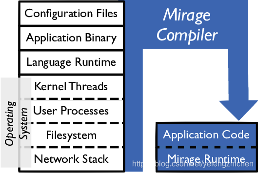
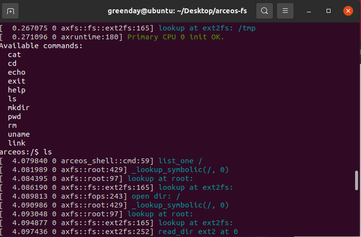
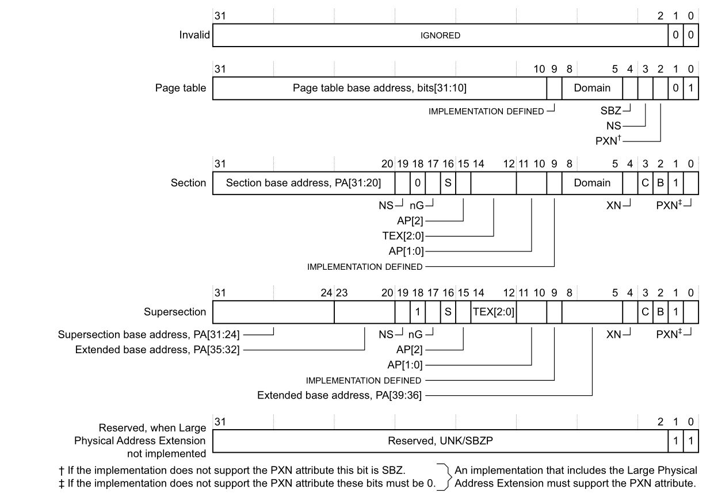
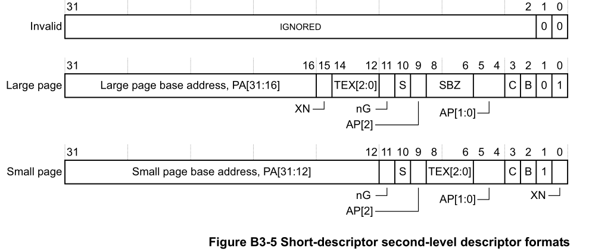

# OSH 2023 结题报告

- ArceOS的完善与优化
- Actus_Neopiritus小组
  - 舒英特 PB21111704（负责总体调度工作，安排任务；开发Ext2文件系统）
  - 陈骆鑫 PB21000039（负责开发新的进程调度算法；Lab4的主要贡献者）
  - 徐翊然 PB21000193（负责提供新的架构支持）
  - 张学涵 PB21000079（负责实现内存分配算法）

## 一、项目简介

基于组件化设计的思路，用Rust语言的丰富语言特征，设计实现不同功能的独立操作系统内核模块和操作系统框架，可形成不同特征/形态/架构的操作系统内核。让领域操作系统易于定制/开发/复用。

## 二、项目调研

### 项目背景

- 新应用带来的操作系统新需求
  - 偏基础类的机器学习、机密计算，以及偏行业类的自动驾驶、工业机器人等新兴计算机领域，带来了各种不同的新应用需求。例如在智能汽车的控制领域，需要支持非常轻量实时高可靠的嵌入式应用；在智能汽车的智驾领域，需要支持AI加速和及时处理环境大数据的人工智能应用。这几类应用的需求更偏向于安全、可靠地及时响应事件和高效处理数据，对操作系统的功能要求和外设支持要求相对也少了不少。
    - 现有的Linux、Windows等传统通用操作系统不能充分地满足这些需求。对于这类应用，使用庞大的通用操作系统在功能上当然可以满足要求，但会带来性能、安全和可靠性等方面的不足；小型、专用的操作系统则更容易满足这方面的要求。
    - 现有的RTOS等专用系统不能充分地满足这些需求。现有的RTOS主要面向的是传统的嵌入式应用，所以在设计上很简洁，实时性是其考虑的重点。但现有的人工智能应用的复杂性很高，大量人工智能应用在Linux上开发和运行，难以直接运行在RTOS上。如果要运行在RTOS上，需要考虑对AI加速外设的支持，以及对Linux应用的支持，这对很多RTOS而言，有比较大的挑战。
  - 因此，这些领域的开发者希望研发面向特定领域的新型操作系统。然而，操作系统开发工作的复杂性让开发者望而却步。针对这种需求，我们希望让开发操作系统变得像开发应用一样简单和高效。
- **开发组件化的定制操作系统**
  - 开发组件化的定制操作系统是解决这个问题的方案之一。我们认为将来的操作系统不是像现在统治世界的 Linux、Windows 那样庞大而通用，而是各种可以迅速组合形成的，并且功能丰富多彩的组件化定制操作系统，能够快速适配未来多种多样的处理器、加速器、外设和应用需求，在开发的便捷性、性能和安全性等方面优于已有的通用操作系统。但如何设计组件化定制操作系统是一个需要深入思考的挑战性问题。
    - 实际上，传统的Linux、Windows、FreeBSD也采用了模块化/组件化的设计思路，而且支持内核模块的动态加载和卸载；但由于它们把通用性和性能放在第一位，而且采用C/C++编写，各个模块之间的数据访问和函数调用都以紧耦合的方式。这个特性使得这些操作系统的软件不具有重用性，很难被其他操作系统使用。这样，这些操作系统为了实现对各种应用的支持，变得越来越庞大和臃肿。
- **开发高鲁棒性、高性能的操作系统**
  - 由于我们需要开发的是一个通用模块化操作系统，系统内核的鲁棒性及性能必须得到保证。一个含有bug的低性能内核对这样一个系统是不可接受的。内核最好还能保证良好的实时性，以便定制为实时操作系统。

### 重要性分析

- **[Rust](https://www.rust-lang.org/)：适合操作系统开发的新兴编程语言**
  - Rust 语言具有与 C 一样的硬件控制能力，且大大强化了安全编程。Rust 的*程序效率*与 C 相近，但其现代性、抽象表达能力高于 C 语言，故 Rust 的*程序开发效率*高于 C。这可以体现在以下几个方面：
    - 内存管理。C 语言使用手动内存管理，需要开发者负责申请和释放内存，这给编程带来了很多复杂性和风险，比如内存泄漏、野指针、缓冲区溢出等。Rust 语言使用所有权系统和借用检查机制，在编译期就能保证内存安全和线程安全，无需垃圾回收或运行时开销，让开发者更专注于程序本身。
    - 类型系统。C 语言使用弱类型系统，类型转换和运算比较灵活，但也容易引发错误和未定义行为。Rust 语言使用强类型系统，类型转换和运算需要显式注明，但也能提供更多的安全保障和抽象能力。Rust 语言还支持泛型、特征、枚举等高级类型特性，让代码更具表达力和复用性。
    - 编程范式。C 语言是一种过程式编程语言，主要使用函数和结构体来组织代码，没有面向对象或函数式编程的支持。Rust 语言是一种多范式编程语言，既可以使用函数和结构体来进行过程式编程，也可以使用方法、特征实现和闭包来进行面向对象或函数式编程。
    - 标准库。C 语言的标准库非常简单，只提供了一些基本的数据结构、算法、输入输出、数学运算等功能，很多高级或常用的功能需要依赖第三方库或自己实现。Rust 语言的标准库非常丰富，除了提供基本的数据结构、算法、输入输出、数学运算等功能外，还提供了并发、网络、文件系统、错误处理、测试、宏等高级功能。
  - Rust 操作系统已经有一些知名的项目，如 Redox OS、rCore OS 和 Tock OS，它们分别展示了 Rust 语言在通用操作系统、教学操作系统和嵌入式操作系统方面的应用。Rust 操作系统又以下几个优势：
    - 可以避免内存和并发错误。因为 Rust 语言有严格的所有权和生命周期检查，以及零成本的抽象。
    - 可以在不同的硬件平台上运行。因为 Rust 语言有良好的跨平台支持和底层控制能力，并支持包括 x86、ARM、MIPS 和 RISC-V 等各种指令集。
    - 可以运行许多现有程序。因为 Rust 语言拥有健全的生态与丰富的标准库，其能够兼容 POSIX 标准，并对 C 语言无缝集成。
    - 可以实现高性能和低资源占用。因为 Rust 语言有编译期优化和无运行时开销，以及对并发和异步编程的原生支持。
- **[ArceOS](https://github.com/rcore-os/arceos)：用 Rust 编写的实验性模块化操作系统**
  - ArceOS是 [rCore-OS](https://rcore-os.cn/) 开源操作系统社区的子项目之一，其灵感很大程度上来自 Unikraft。
  - 正在迅速地开发，在 [GitHub](https://github.com/rcore-os/arceos) 仓库中能找到实时信息。
- **[seL4](https://sel4.systems/)：目前唯一通过形式化证明的实时内核（候选项目）**
  - seL4 是一个开源的微内核操作系统，它是世界上第一个经过形式化验证的操作系统内核。这意味着它的实现已经被证明是正确的，且符合其规范。这为 seL4 提供了极高的安全性和可靠性。
  - seL4 还具有出色的实时性能，它是目前唯一具有完整实时性分析的保护模式操作系统内核。这意味着它具有可证明的中断延迟上限（以及任何其他内核操作的延迟）。
  - seL4 提供了操作系统所必需的服务，如线程、IPC、虚拟内存、中断等。它还支持虚拟机，可以运行完整的客户端操作系统，如 Linux。
  - 详情可见 seL4 [白皮书](https://sel4.systems/About/seL4-whitepaper.pdf) 和 [中文翻译](https://blog.csdn.net/lgfx21/article/details/117606097)。

### 相关工作

- **组件化定制操作系统的历史回顾**

  - 早在二十世纪九十年代，学术界就已经尝试过组件化定制操作系统的想法，如MIT的PDOS课题组提出的[Exokernel](https://pdos.csail.mit.edu/archive/exo/)和剑桥大学等提出的[Nemesis](https://www.cl.cam.ac.uk/research/srg/netos/projects/archive/nemesis/)操作系统是第一轮组件化操作系统的探索。

    - 其特点是通过把操作系统的部分功能以专用库的形式提供给应用程序使用，运行在用户态，以提升系统的整体性能。由于开发的成本过高，而使用领域比较窄，没有在产业界落地。

  - 进入二十一世纪，随着互联网的发展，如何优化云计算和虚拟化成为了新热点，学术界开始了第二轮组件化操作系统的发展。

    - 在2002年，犹它大学计算机科学系FLUX研究组提出了[OSKit](https://www.cs.utah.edu/flux/oskit/)项目，基于C语言设计了34个组件库和一个连接这些组件库的框架来形成不同功能的特定操作系统内核，其目标在于降低操作系统的研发门槛和成本。
    - [MirageOS](https://mirage.io/)是一个基于OCaml语言编写的库操作系统，它构建了安全的，高性能和资源节约型unikernel。代码可以在普通操作系统上开发，然后编译成在Xen或KVM虚拟机管理程序下运行的完全独立的专用单内核。
    - 这一次的探索依然没有被产业界广泛接受。这与编程语言的选择有很大的关系。C语言没有方便的面向对象的能力，也缺失泛型等语言特征，不具有广泛的重用性，难以形成可被广泛重用的组件。而OCaml语言的抽象能力很强，安全性也很好，但它具有主流函数式语言的通病，相对于C语言，其通用性很弱，而性能更差，缺少对已有应用的支持。

  - 2018年，Rice大学提出了基于Rust语言的[Theseus](https://github.com/theseus-os/Theseus)操作系统，通过精心设计的内核组件，支持操作系统的组件在线更新，使得操作系统的可靠性得到很大增强。但由于过于注重高可靠设计，在性能和已有应用的支持比较差。

  - 2014年以后，学术界意识到如果要得到产业界的认可，需要支持在性能和应用支持上突破，这方面的代表是多家单位合作设计的[Unikraft](https://github.com/unikraft/unikraft)操作系统。

    - Unikraft是一个快速，安全和开源的unikernel开发工具包，采用C语言编写，由不同的组件库构成，支持云计算环境中的常用Linux应用。由于其unikernel架构设计，Unikraft可以根据应用程序的特定需求定制操作系统、库和配置，大幅减少存储空间和其他软件的恶意攻击，同时让应用程序和OS内核都运行在特权态，提高了整体性能。Unikraft的性能和对Linux应用的支持，使得它得到了产业界一定的认可和使用。但Unikraft采用C语言设计实现，这导致了内核组件的重用性和安全性还需提高。

  - 这些组件化操作系统的尝试告诉我们几点：

    - 组件化操作系统致力于增强重用性和可靠性，但决不能忽视性能问题。
    - 使用合适的编程语言十分重要。

    

- **使用 Rust 开发操作系统的尝试**

  - [Redox](https://en.wikipedia.org/wiki/Redox_(operating_system))
    - Redox 内核基于微内核的概念，受到 MINIX 的启发
    - Ralloc – 内存分配器
    - TFS 文件系统 – 受到 [ZFS 文件系统](https://en.wikipedia.org/wiki/ZFS)的启发
    - Ion shell – Redox 中用于执行命令和脚本的基础库，也是默认的 shell
    - Redox OS 支持命令行界面 (CLI) 程序，也支持图形用户界面 (GUI) 程序
    - 参考资料：[Redox OS book](https://doc.redox-os.org/book/)
  - [rCore](https://rcore-os.github.io/)
    - 基于 RISC-V 架构，具有简单、模块化、可扩展的特点。
    - 支持多核和用户态进程，实现了基本的并发和抽象机制，如线程、进程、调度、同步、通信等。
    - 支持虚拟内存和文件系统，实现了基本的内存管理和存储管理机制，如分页、映射、缺页异常、文件操作等。
    - 支持系统调用和动态链接库，实现了基本的用户态程序运行环境，如输入输出、异常处理、动态加载等。
    - 支持网络通信和图形界面，实现了基本的网络协议栈和图形设备驱动，如 TCP/IP、Ethernet、Framebuffer 等。
    - 参考资料：[rCore-Tutorial-Book 第三版](http://rcore-os.cn/rCore-Tutorial-Book-v3/)，[rCore OS 开发文档（长久未更新）](https://rcore.gitbook.io/rust-os-docs/)，[BlogOS](https://os.phil-opp.com/)（rCore 基于 BlogOS）
  - [Tock](https://www.tockos.org/)
    - Tock OS 是一种为低功耗，低内存微控制器设计的嵌入式操作系统，它可以支持多个并发的，互不信任的应用程序。
    - Tock OS 允许第三方开发者使用驱动程序和内核扩展来增加系统的功能，而不需要修改内核代码。
    - Tock OS 使用协作式调度模型来管理内核中的组件，称为胶囊（capsules），以及用户空间中的进程（processes）。这样可以避免抢占式调度带来的资源消耗和上下文切换开销，同时保证系统的响应性和实时性。
    - Tock OS 支持自动的低功耗操作，根据系统的负载和外部事件来调整微控制器的工作模式和电源管理。
    - Tock OS 的设计使其能够在消费级物联网设备（如运动手表或健身追踪器）上运行，这些设备需要在小型电池上运行数月，并且具有低内存微控制器，以支持第三方应用程序，就像 PC 级操作系统一样。
  - [OSH-2019/x-qwq](https://github.com/OSH-2019/x-qwq/)
    - 已有学长用 Rust 改写 seL4 微内核，并成功编译出了一个操作系统。我们将有关 seL4 的工作作为候选项目。

## 三、项目设计

### Ext2文件系统的实现

​Ext2文件系统最早由Rémy Card于1993年设计并实现。它是对原始Ext文件系统的改进，支持更大的文件系统容量、更高的性能和更好的可靠性。Ext2文件系统被广泛用于Linux系统上的硬盘驱动器分区，适用于各种应用场景。

​Ext2文件系统采用基于磁盘的数据结构来组织文件和目录。它使用超级块、组描述符、索引节点（inode）和数据块来存储文件系统的元数据和用户数据。Ext2采用分组的方式组织数据块，每个分组包含一组数据块、索引节点和目录。这种组织方式提供了更高的文件系统效率和灵活性。现如今主流Linux发行版采用Ext4文件系统，但Ext2文件系统易于实现，资源利用率高，非常适合应用在ArceOS之上。

​在ArceOS中，主要使用/ulib/libax中fs库中的函数（类似于rust中的std）访问文件系统，这些函数被模块/module/axfs实现。该模块提供了一套vfs（虚拟文件系统）接口。新的文件系统只需正确实现这些接口，并在文件系统的初始化过程中，用#cfg选择对应的文件系统就可以挂在新的文件系统。因此在该模块中使用一些包装类就可以无缝对接ArceOS代码实现。

```rust
impl VfsOps for Ext2FileSystem
impl VfsNodeOps for Ext2SymlinkWrapper
impl VfsNodeOps for Ext2FileWrapper
impl VfsNodeOps for Ext2DirWrapper
```

​真正实现Ext2文件系统具体内容是在/crates/ext2fs当中。这个箱子借鉴了easy-fs的文件系统库，借助BlockDevice的接口实现了Layout、Bitmap、Inode、Cache等核心内容，并向外提供对应接口。/module/axfs使用这些接口，

测试的方法主要包括以下两种：

- 利用app/fs/shell进行测试。输入如下命令

    ```shell
    make disk_img
    make A=apps/fs/shell ARCH=riscv64 LOG=debug FS=y run
    ```

    正常运行应该得到一个支持简单命令的shell。

    

    通过运行这些命令，检查文件系统的正确性。

- 利用cargo test进行测试

    将目录切换到module/axfs/中，执行如下命令：

    ```shell
    ./resources/create_ext2.sh
    cargo test
    ```

    得到以下输出说明测试无误：

    ```shell
    running 1 test
    test test_fs ... ok

    test result: ok. 1 passed; 0 failed; 0 ignored; 0 measured; 0 filtered out; finished in 0.09s
    ```

### MLFQ调度算法

`多级队列反馈调度(Multi-Level Feedback Queue, MLFQ)`算法在1962年首次被提出，用于`兼容分时操作系统（Compatible Time-Sharing System, CTSS）`。在这种算法注重的场景下，既有交互式短任务，又有CPU密集型的长任务。因此，算法的目标是既要优化交互式任务的**响应时间**，又要让CPU密集型任务有足够长的时间运行，一定程度上降低**周转时间**。

首先，考虑如果我们已经知道了所有进程的特征，应该怎么做。很显然，只要存在准备好的交互式进程，就要优先响应它们；而对于交互式进程，应该采用时间片轮转(RR)的方式调度，以降低响应时间。对计算密集型进程，为公平和统一起见，不妨也采用RR算法；但这时不需要低响应时间，因此我们可以适当增加时间片大小。这样，我们就抽象出了一个优先级的模型：交互式进程设为高优先级，CPU密集型设为低优先级；同优先级采用RR调度，且时间片大小与优先级负相关（规则1、2）。当然，交互式或计算型任务并不是简单的二分类，因此我们可以适当增加优先级的数量。这其实就是基本的固定优先级的多级无反馈队列调度。

但很显然，我们并不能一开始知道每个进程的特点；同时，交互式/计算式也不是固定的性质：一个程序完全可以一段时间内表现为交互式，一段时间表现为计算型任务。因此，*Corbato*提出了MLFQ这种调度方式。这种算法的思想是**以史为鉴**，通过进程过去一段时间内的表现，估计进程的特征，据此动态调整其优先级。其基于上面的多级队列调度，且基本规则如下（规则3、4）：

- 进程进入系统时，放在最高优先级（最上层队列）。
- 如果进程用完整个时间片，降低其优先级。否则（时间片结束前主动让出CPU），保持在相同优先级不变。

这样，交互式进程会停留在顶层，获得最快的响应时间，而长进程降到底层，获得更多的CPU时间，实现了我们的目标。另外，考虑当没有交互式进程的特殊情况，所有进程会同时下降其优先级，短进程一段时间内运行完毕，而长进程降到底层轮转运行；由于高优先级时间片较小，这其实一定程度上近似了SJF调度，使得周转时间的指标也得到了优化。

目前的调度仍然存在两个问题。首先，如果存在大量交互式进程，就会出现饥饿问题；另外，程序从计算式进程转到交互式进程的情况并没有被考虑到。我们只要加入最后一个规则：每经过一段时间 S，将系统中所有工作重新加入最高优先级队列（规则5）。这样，两个问题都得到了解决。

最后，调度最难的部分其实仍然是设置一个合理的参数。虽然比起教材上抽象的描述，我们已经确定了十分具体的调度方案，但仍然有三个重要的参数需要设置：队列数量，时间片与优先级关系，以及优先级重置时间。大多数MLFQ调度的实现都动态配置这三个参数，例如Solaris提供了一组管理员可修改的表来决定它们。该表默认有60层队列， 时间片长度从20毫秒（最高优先级），到几百毫秒（最低优先级），每一秒左右提升一次进程的优先级。

我们考虑如何为ArceOS这一系统加入MLFQ调度方式。ArceOS目前在最顶层用户库`libax`中模仿`std::thread`，提供了`thread`这一API，功能为`axtask`模块的封装；而`axtask`涉及到调度的部分会调用`scheduler`模块的接口，其中可以选择已经实现的`fifo`，`rr`等调度器。因此，要实现新的调度器，只需在`scheduler`模块中加入新的调度器代码，并接入到上层API即可。


为了方便开发、维护等，ArceOS将调度器抽象为[`BaseScheduler`](http://rcore-os.cn/arceos/scheduler/trait.BaseScheduler.html)这一trait，只要为调度器类实现这一trait，即可接入调度接口。下面逐条分析该trait的实现：

- `type SchedItem;`

  - 调度器中存放的不仅有任务，还包括与任务相对应的信息。例如对RR调度器，需要额外记录目前剩余的时间片，以判断时间是否耗尽。对MLFQ，我们需要记录任务的优先级，同时由于同级采用RR调度，也需要剩余时间片的信息。因此我们的任务定义如下：

    ``` rust
    pub struct MLFQTask<T, const LEVEL_NUM: usize, const BASE_TIME: usize, const RESET_TIME: usize> {
        inner: T,
        priority: AtomicIsize,
        remain_time: AtomicIsize,
    }
    ```

- `fn init(&mut self);`

  - 初始化调度器。本实现不需要额外的初始化，因此该函数为空。

- `fn add_task(&mut self, task: Self::SchedItem);`

  - 向调度器中加入任务。我们将其放入对应优先级的队列即可。

    ``` rust
    self.ready_queue[task.get_prio() as usize].push_back(task);
    ```

- `fn remove_task(&mut self, task: &Self::SchedItem) -> Option<Self::SchedItem>;`

  - 从调度器中移除任务，返回其所有权。只要从对应队列中移除即可。

    ``` rust
    self.ready_queue[task.get_prio() as usize]
                .iter()
                .position(|t| Arc::ptr_eq(t, task))
                .and_then(|idx| self.ready_queue[task.get_prio() as usize].remove(idx))
    ```

- `fn pick_next_task(&mut self) -> Option<Self::SchedItem>;`

  - 从调度器获取下一个要执行的任务。根据前两条规则，我们选择优先级最高的有任务的队列，返回队首任务。

    ``` rust
    // Rule 1: If Priority(A) > Priority(B), A runs (B doesn’t).
    // Rule 2: If Priority(A) = Priority(B), A & B run in round-robin fashion using the time slice (quantum length) of the given queue.
    for i in 0..self.ready_queue.len() {
        if !self.ready_queue[i].is_empty() {
            return self.ready_queue[i].pop_front();
        }
    }
    return None;
    ```

- `fn put_prev_task(&mut self, prev: Self::SchedItem, preempt: bool);`

  - 放回之前取出的任务。其中参数`preempt`代表该任务是否是被抢占的，如果是被抢占的，它有机会被放到队首。根据规则4，如果用完了时间片，我们对其降级。

    ``` rust
    // Rule 4: Once a job uses up its time allotment at a given level its priority is reduced.
    let rem = prev.get_remain();
    let prio = prev.get_prio();
    if rem <= 0 {
        prev.prio_demote();
        self.ready_queue[prev.get_prio() as usize].push_back(prev);
    } else if preempt {
        prev.reset_time();
        self.ready_queue[prio as usize].push_front(prev);
    } else {
        prev.reset_time();
        self.ready_queue[prio as usize].push_back(prev);
    }
    ```

- `fn task_tick(&mut self, current: &Self::SchedItem) -> bool;`

  - 通知调度器经过了一次时钟中断，调度器返回是否需要重新调度。根据规则2和5，需要重新调度的有两种情况：目前任务用完了时间片，或者到了重置优先级的时间。

    ```rust
    // Rule 5: After some time period S, move all the jobs in the systemto the topmost queue.
    if self.reset_remain_ticks.fetch_sub(1, Ordering::Release) <= 1 {
        self.reset_remain_ticks.store(RESET_TIME as isize, Ordering::Release);
        let mut new_queue : VecDeque<Arc<MLFQTask<T, LEVEL_NUM, BASE_TIME, RESET_TIME>>> = VecDeque::new();
        for i in 0..LEVEL_NUM {
            while let Some(item) = self.ready_queue[i].pop_front() {
                item.reset_prio();
                new_queue.push_back(Arc::clone(&item));
            }
        }
        self.ready_queue[0] = new_queue;
        for i in 1..LEVEL_NUM {
            self.ready_queue[i].clear();
        }
        current.reset_prio();
        // need reschedule
        return true;
    }
    // need reschedule
    current.tick() <= 1
    ```

- `fn set_priority(&mut self, task: &Self::SchedItem, prio: isize) -> bool;`

  - 设置当前任务的优先级，并返回是否成功。我们不允许用户手动设置优先级，所以只需一直返回false。

我们对实现的MLFQ调度做简单的测试。

首先，ArceOS为调度器提供了一个基础速度的评测，可以直接使用，测量指标为从调度器中的pick速度和remove速度。对不同调度算法的测试数据如下：

- | 调度算法 | pick速度           | remove速度          |
  | -------- | ------------------ | ------------------- |
  | MLFQ     | 61 $ns/task$       | 62.827 $\mu s/task$ |
  | FIFO     | 44 $ns/task$       | 56 $ns/task$        |
  | RR       | 28 $ns/task$       | 66.649 $\mu s/task$ |
  | CFS      | 1.392 $\mu s/task$ | 862 $ns/task$       |

- 可以看到我们实现的MLFQ基础速度上相比RR慢的并不多。

另外，ArceOS已经存在一些基础的测试，稍作修改后就可以直接使用。

- parallel：简单的并行测试

  - 该测试简单地启动16个任务，最后将结果聚在一起并与正确结果比对，用于判断所有任务是否能成功结束，且结果是否正确。

  - 测试成功

    ```text
    part 15: TaskId(19) finished
    part 0: TaskId(4) finished
    part 1: TaskId(5) finished
    part 2: TaskId(6) finished
    part 3: TaskId(7) finished
    part 4: TaskId(8) finished
    part 5: TaskId(9) finished
    part 6: TaskId(10) finished
    part 7: TaskId(11) finished
    part 8: TaskId(12) finished
    part 9: TaskId(13) finished
    part 10: TaskId(14) finished
    part 11: TaskId(15) finished
    part 12: TaskId(16) finished
    part 13: TaskId(17) finished
    part 14: TaskId(18) finished
    sum = 61783189038
    Parallel summation tests run OK!
    ```

- priority：优先级测试

  - 在该测试中，存在四个较短的任务，和一个长任务同时运行，且短任务被赋予不同的优先级。由于我们的调度器并不允许手动指定优先级，因此不能进行优先级测试，但该测试可用于观察近似SJF的程度。

  - 我们与已实现的其它算法对比：（时间均以毫秒计算）

    | 调度算法 | Task 0 | Task 1  | Task 2  | Task 3  | Task 4 （长任务） |
    | -------- | ------ | ------- | ------- | ------- | ----------------- |
    | **MLFQ** | **68** | **138** | **207** | **277** | **347**           |
    | RR       | 268    | 287     | 308     | 328     | 347               |
    | FIFO     | 69     | 139     | 209     | 279     | 348               |

  - 可以看到该例中MLFQ对SJF有较好的近似。（FIFO由于顺序与长短正好相同，调度也与SJF相同）

- 此外还有sleep和yield两个测试，用于测试这两个功能的正确性，我们的调度均通过了测试，在此不再展开。

此外，为了更详细地评测调度算法，我们添加了更多测试：

- realtime：响应时间测试

  - 有四个**交互式**（运行极短时间后主动yield，大量循环）短进程和一个长进程同时运行，判断长进程的运行对短进程的响应时间的影响。

  - 任务的总响应时间如下表：

  - | 调度算法 | Task 0  | Task 1  | Task 2  | Task 3  | Task 4 （长任务） |
    | -------- | ------- | ------- | ------- | ------- | ----------------- |
    | **MLFQ** | **402** | **395** | **375** | **190** | **1771**          |
    | RR       | 1745    | 1736    | 1716    | 1705    | 1680              |
    | FIFO     | 1744    | 1735    | 1717    | 1706    | 1682              |

  - 这里RR的表现相对并不好，原因是交互式进程**每次**都要等待长进程运行一个时间片；而MLFQ是在没有就绪高优先级任务之后，才运行低优先级任务。

- starvation：饥饿测试

  - 有四个不停止的交互式任务，观察在该情况下长任务完成的用时。

  - | 调度算法 | 长任务完成时间                     |
    | -------- | ---------------------------------- |
    | MLFQ     | 1713                               |
    | RR       | 1691                               |
    | FIFO     | 1678                               |
    | CFS      | （与优先级设置有关）2000-15000不等 |

  - 可以看到本测试中MLFQ对饥饿控制的较好，但这并不是无代价的，与参数的设置有很大关系。

### 内存分配

ID 分配器（ID Allocator）是一个用于管理唯一标识符（ID）的分配与回收的工具。其功能主要包括：

- 分配唯一 ID：每次请求一个新的 ID 时，ID 分配器会生成一个尚未分配的唯一 ID。这个 ID 通常是一个自增的整数。
- 释放 ID：当某个 ID 不再使用时，可以将其归还给 ID 分配器。这样，在需要新的 ID 时，分配器可以重用这些已释放的 ID，从而减少 ID 耗尽的风险。
- 确保 ID 唯一性：ID 分配器需要确保在任何时候，分配出去的 ID 都是唯一的。

在操作系统中，ID 分配器主要用于管理系统资源的标识符，确保了每个资源能够被准确识别和管理。其有如下应用：

- 进程和线程 ID 分配：操作系统为每个进程和线程分配一个唯一的 ID，称为进程 ID（PID）和线程 ID（TID）。这些 ID 用于标识和管理各种进程和线程，例如调度、同步和资源分配。
- 文件描述符分配：操作系统为每个打开的文件和套接字分配一个唯一的整数 ID，称为文件描述符（File Descriptor, FD）。文件描述符用于表示打开的文件或套接字，并通过系统调用（如 read、write 和 close）进行操作。
- 内存页表项分配：在虚拟内存管理中，操作系统需要为每个内存页分配一个唯一的虚拟地址。为了实现这一目标，操作系统使用 ID 分配器来分配和管理虚拟地址空间中的页面。

操作系统中的 ID 分配器通常需要具备高性能、低开销和易于管理的特性。为了实现这些目标，操作系统内核可能会采用各种优化策略，如分层管理、缓存和预分配。这些策略有助于提高 ID 分配和回收的速度，降低资源耗尽的风险，并简化资源管理任务。[kernel.org](https://www.kernel.org/doc/html/latest/core-api/idr.html) 中介绍了 Linux Kernel ID 分配器提供的 API。

在 arceOS 中，ID 分配器源码位于 `crates/allocator/src`。其中 ID 分配器需要实现 7 个功能。

```rust
/// Allocate contiguous IDs with given count and alignment.
fn alloc_id(&mut self, count: usize, align_pow2: usize) -> AllocResult<usize>;
```

`alloc_id` 方法的目的是分配 `count` 个连续的 ID，并确保第一个 ID 满足对齐要求。其设计思路如下：

1. 参数检查：首先检查输入参数 `count` 是否合法，其不应为 0。此外，`let align = 1 << align_pow2`。
1. 计算第一个 ID：`base_id` 是第一个可能满足对齐要求的 ID。我们可以将 `next_id` 向上舍入到最接近的 `align` 的倍数，得到 `base_id`。这可以通过以下公式实现：(`next_id` + `align` - 1) / `align` * `align`。
1. 如果 `base_id` 超过 ID 的最大范围，则分配失败，返回 `AllocResult::Failed`。
1. 分配 ID：从 `base_id` 起便是 `count` 个连续的空闲 ID。我们需要将原 `next_id` 到 `base_id` - 1 的 ID 加入至 `free_ids` 中，以表明它们尚未分配（可以用哈希表实现 `free_ids` 集合，单点修改/查询时间均为 $O(1)$）。同时，我们需要更新 `next_id` 的值，确保它大于已分配的最大 ID。
1. 分配成功，返回基址 ID 的值 `AllocResult::Ok(base_id)`。

这种设计方法寻找空闲 ID 时，无需任何循环遍历，这在大多数情况下效率较高。然而，在极端情况下，如果 ID 空间非常分散，这可能导致 `free_ids` 修改量大，时间复杂度恶化至 $O(n)$，其中 $n$ 为最多 ID 数目。针对这种情况，可以考虑使用更高级的数据结构（如线段树）来实现 `free_ids`，其时间复杂度为 $O(\log n)$；但对于一般情况，线段树常数较大，没有较大价值。

```rust
/// Deallocate contiguous IDs with given position and count.
fn dealloc_id(&mut self, start_id: usize, count: usize);
```

`dealloc_id` 方法的目的是释放 `count` 个连续的 ID。其设计思路如下：

1. 释放连续的 `count` 个 ID 时，我们将 `start_id` 到 min(`next_id`, `start_id` + `count`) - 1 的每个 ID，插入至 `free_ids` 集合中。这表明该 ID 现在是空闲的，可以在下次分配时被重用。
1. 随后，逐步尝试递减 `next_id`，直至 `next_id` 为 0 或 `next_id` - 1 不在 `free_ids` 中。`next_id` 递减时，也要将相应的 `next_id` - 1 从 `free_ids` 中移除。

```rust
/// Whether the given `id` was allocated.
fn is_allocated(&self, id: usize) -> bool;
```

`is_allocated` 方法的目的是检查 ID 是否已经分配。其设计思路如下：

1. 如果 `id` 大于等于 `next_id`，则说明它尚未分配。在这种情况下，应返回 `false`。
1. 如果 `id` 小于 `next_id`，我们需要检查它是否在 `free_ids` 集合中。如果在，说明它已经被释放，因此返回 `false`；否则，说明它已被分配，返回 `true`。

```rust
/// Mark the given `id` has been allocated and cannot be reallocated.
fn alloc_fixed_id(&mut self, id: usize) -> AllocResult;
```

`alloc_fixed_id` 方法的目的是将给定的 `id` 标记为已分配，确保它不会在后续分配中被重用。其设计思路如下：

1. 先调用 `is_allocated` 方法判断 `id` 是否已分配。若 `id` 已分配，则返回 `AllocResult::Failed`。
1. 若 `id` 未分配，则分配 `id`，并返回 `AllocResult::Ok`：
   - 如果 `id` 小于 `next_id`，则将其从 `free_ids` 集合中移除。
   - 如果 `id` 大于等于 `next_id`，则需要将 `next_id` 更新为 `id` + 1，以确保后续分配的 ID 不会与 `id` 重复。另外，需要将原 `next_id` 到 `id` - 1 的 ID 加入至 `free_ids` 集合中。

```rust
/// Returns the maximum number of supported IDs.
fn size(&self) -> usize;
```

`size` 方法的目的是查询 ID 的最多数目（ID 的最大值 + 1）。这通常是人为规定的常量，直接返回即可。

```rust
/// Returns the number of allocated IDs.
fn used(&self) -> usize;
```

`used` 方法的目的是查询已分配的 ID 数目。返回值为 `next_id` - `free_ids.len()`。

```rust
/// Returns the number of available IDs.
fn available(&self) -> usize;
```

`available` 方法的目的是查询可用的 ID 数目。返回值为 `size()` - `used()`。

### Arm架构支持

一开始项目计划实现MIPS支持，但是查阅RUST文档发现rust对MIPS支持不好。根据[官方文档](https://doc.rust-lang.org/stable/reference/inline-assembly.html)的说明，rust不直接支持MIPS汇编内嵌，如果要内嵌汇编则需要利用RUST-C接口，先用C语言内嵌汇编码，再用rust调用。同时，[官方文档](https://doc.rust-lang.org/rustc/platform-support.html#tier-3)显示，RUST官方对MIPS的支持为第三等级，由此最终改为支持arm架构。具体计划为支持armv7A架构，具体计划支持平台为[arm Cortex-A8](https://developer.arm.com/Processors/Cortex-A8#Technical-Specifications)。

利用`grep`搜索`aarch64`,`x86`,`riscv`这三个关键词查找与架构有关文件，最终发现需要修改文件分为五类：

1. 中断关闭
2. 页表 
3. 程序控制块
4. 启动时系统配置
5. 启动前系统基础配置

本次仅支持了1，2，5及4的一部分。下面依次讨论：

1. 仅需要实现两个函数，既关闭中断及开启中断。根据armv7A架构手册，arm的中断分为FIQ与IRQ两类，关闭时都需要置位。

```rust


```

2. 页表部分主要是需要将架构专用页表转换为通用页表。根据架构手册，arm支持`Short-descriptor translation table format`与`Long-descriptor translation table format`，但是根据手册后者属于扩展内容，不一定都支持，由此仅支持前者。在`Short-descriptor translation table format`内部，又分为三种格式，分别为`Page table`,`Section`,`Supersection`，本次实现仅支持第一个。使用`Page table`时事实上第一次访存得到的是一级页表项（二级描述符）的入口地址，还需二次访存得到具体的物理帧。而一级页也分为两个大小，需要分别支持。




```rust


```

## 四、未来展望

### 支持中断驱动的设备IO

目前，ArceOS操作系统底层支持硬/软中断处理、pci总线协议和mmio机制，但不支持中断驱动的设备IO，导致ArceOS不能支持部分设备，极大的阻碍了ArceOS的发展与进步。

### 开发ArceOS更多驱动

目前ArceOS主要运行在虚拟机环境中，尚未支持蓝牙、鼠标、键盘等驱动，导致其实用性不高，只能用于教育性用途。

### 移植常见应用并开展测试

目前ArceOS缺少实用的应用程序。移植（或新开发）的程序可以以Unikernal模式编译运行在虚拟机上，相比于Docker等传统方法性能大大提升，应用前景广阔。

## 五、项目总结

​本次大作业虽未能成功实现硬件部分，但仍然实现了期望目标的主要功能，包括文件系统、进程调度和内存分配，填补了原先项目的空白。后续的ArceOS开发者可以基于这些功能开发更多、更丰富的模块，壮大ArceOS的生态圈。

​多数大作业作品或许难以被广泛应用，但其中的教育意义不可忽视。在本次大作业的实现中，我们小组充分地熟悉掌握了操作系统开发的工具链，践行了分工合作的精神，这些能力和品质对我们的影响是深远的。
